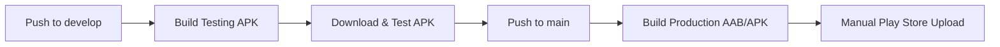

# 🚀 NFT Tax Calculator Pro - Production Deployment Guide

**Version:** 2.0.0 - December 2024  
**Status:** Enterprise Production Ready
**Last Updated:** $(date)

## 📋 **Complete Production Deployment Workflow**

### 🔥 **Quick Start** 
```bash
# 1. Setup repository
git clone https://github.com/your-username/nft-pro
cd nft-pro

# 2. Configure secrets (see .github/SECRETS_SETUP.md)
# Add all required secrets in GitHub Settings

# 3. Trigger build
git push origin develop  # For testing build
git push origin main     # For production build
```

---

## 🏗️ **Build Process Overview**

### **Development → Testing → Production**



---

## 📱 **1. Testing Phase**

### **Push to `develop` branch:**
```bash
git checkout develop
git commit -m "feat: add new feature"
git push origin develop
```

### **What happens automatically:**
- ✅ Runs tests and lint checks
- ✅ Builds **signed release APK** with testing APIs
- ✅ Uploads APK as artifact for download

### **Download & Test:**
1. Go to **GitHub Actions** tab
2. Click on completed workflow run
3. Download `📱-nft-pro-testing-apk-XXX`
4. Install APK on real Android devices
5. Test all features thoroughly

---

## 🚀 **2. Production Build**

### **When testing is complete:**
```bash
git checkout main
git merge develop
git push origin main
```

### **Or create a release tag:**
```bash
git tag v1.0.0
git push origin v1.0.0
```

### **What happens automatically:**
- ✅ Runs tests and lint checks  
- ✅ Builds **signed AAB** with production APIs
- ✅ Builds **signed APK** for final testing
- ✅ Generates ProGuard mapping file
- ✅ Creates GitHub release (for tags)

### **Download Production Files:**
1. Go to **GitHub Actions** tab
2. Click on completed workflow run  
3. Download artifacts:
   - `🏪-nft-pro-production-aab-XXX` → **For Play Store**
   - `📱-nft-pro-production-apk-XXX` → **For final testing**
   - `📋-nft-pro-mapping-XXX` → **For crash reports**

---

## 🏪 **3. Play Store Upload (Manual)**

### **Final Testing:**
```bash
# Install production APK on test devices
adb install nft-pro-production.apk

# Test critical paths:
# - User registration/login
# - NFT contract sync
# - Tax calculations  
# - Export functionality
# - In-app purchases
```

### **Google Play Console Upload:**

1. **Login** to [Google Play Console](https://play.google.com/console)

2. **Navigate** to NFT Pro app → Release → Production

3. **Upload AAB:**
   - Click "Create new release"
   - Upload `*.aab` file (NOT the APK!)
   - Set version name (e.g., "1.0.0")

4. **Upload Mapping:**
   - Go to "App content" → "Deobfuscation files"
   - Upload `mapping.txt` file

5. **Configure Release:**
   ```
   Release name: NFT Pro v1.0.0
   Release notes: (See fastlane/metadata/ for localized notes)
   Rollout: 5% (for staged rollout)
   ```

6. **Submit for Review**

---

## 📊 **4. Monitoring & Analytics**

### **After Release:**
- 📈 **Firebase Analytics** - User behavior tracking
- 🚨 **Crashlytics** - Crash reports with mapping files
- 💰 **RevenueCat** - Subscription metrics  
- 📱 **Play Console** - Download and rating stats

### **Staged Rollout Management:**
```
Week 1: 5% rollout   → Monitor crash rates
Week 2: 20% rollout  → Check reviews/ratings
Week 3: 50% rollout  → Verify revenue metrics  
Week 4: 100% rollout → Full deployment
```

---

## ⚙️ **5. Build Configuration Details**

### **Environment Variables:**

| Environment | APIs Used | Firebase Project | Billing |
|------------|-----------|------------------|---------|
| **Testing** | Testnet/Sandbox | nft-pro-staging | Sandbox |
| **Production** | Mainnet/Live | nft-pro-prod | Live |

### **Build Variants:**
```gradle
buildTypes {
    debug {
        applicationIdSuffix = ".debug"
        versionNameSuffix = "-debug"
        // Not used in CI/CD
    }
    release {
        minifyEnabled = true
        proguardFiles(getDefaultProguardFile("proguard-android-optimize.txt"))
        // Used for both testing and production
    }
}
```

### **Signing Configuration:**
- **Same keystore** used for testing and production builds
- **Different API keys** for testing vs production
- **ProGuard mapping** generated for crash analysis

---

## 🔧 **6. Troubleshooting**

### **Build Fails:**
```bash
# Check logs in GitHub Actions
# Common issues:
# - Missing secrets
# - Invalid keystore
# - API key errors
# - Gradle cache corruption
```

### **APK Install Fails:**
```bash
# Enable "Install from Unknown Sources"
# Check device compatibility (Min SDK 24)
# Verify APK is properly signed
adb logcat | grep -i "packageinstaller"
```

### **Play Store Upload Issues:**
```bash
# Common problems:
# - Wrong file type (use AAB, not APK)
# - Version code conflicts  
# - Missing permissions in manifest
# - Duplicate SHA-256 certificates
```

---

## 📈 **7. Success Metrics**

### **Technical KPIs:**
- ✅ Build success rate > 95%
- ✅ APK install success > 98%
- ✅ Crash rate < 1%
- ✅ App startup time < 2s

### **Business KPIs:**
- 📈 Download conversion > 15%
- 💰 Free to paid conversion > 10%  
- ⭐ Average rating > 4.2
- 🔄 Monthly retention > 85%

---

## 🎯 **Next Steps**

1. **Setup CI/CD** following this guide
2. **Test thoroughly** with multiple devices
3. **Configure analytics** and monitoring
4. **Plan marketing** and ASO optimization
5. **Prepare support** documentation

---

**🚀 Ready to deploy NFT Pro!** 

Follow this guide step-by-step and you'll have a production-ready app on Google Play Store with professional CI/CD pipeline.